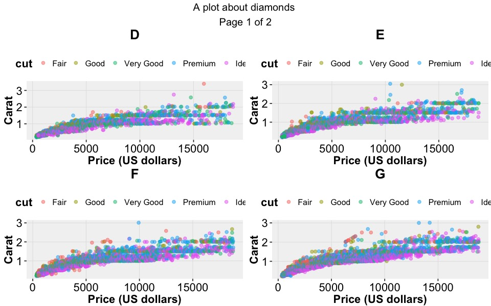
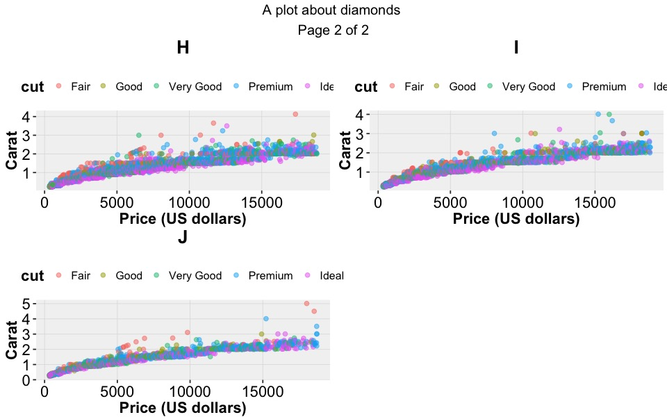

```{r setup, include=FALSE}
knitr::opts_chunk$set(echo = TRUE,
                      fig.path = 'inst/img/', 
                      dev = 'jpeg', 
                      fig.ext = 'jpg', 
                      fig.show = 'hide',
                      fig.width = 8, 
                      fig.height = 5, 
                      dpi = 120)
```

[](https://travis-ci.org/guiastrennec/ggplus)


# `ggplus`

Set of additional functions for `ggplot2`


## Rationale

To facilitate data exploration and model diagnostics by providing additional functions for `ggplot2`.


## Installation

### Install the `ggplus` package 

Only needed the first time you use `ggplus`

```{r, eval = FALSE}
devtools::install_github("guiastrennec/ggplus")
```


### Load `ggplus` package

Needed every time you want to use `ggplus`

```{r, message=FALSE}
library(ggplus)
```

*Note:* Trying to install the package the `install.packages('ggplus')` (reserved for packages available on CRAN-like repositories) would result in the following error:
```
Warning in install.packages :
  package ‘ggplus’ is not available (for R version 3.3.1)
```


## Package content

### `facet_multiple()`

`facet_multiple()` is an extension of `facet_wrap()` in `ggplot2` that allows to split panels over multiple pages.

#### Example
```{r facet_multiple}
# Generate ggplot object
p <- ggplot(diamonds, aes(x = price, y = carat, color = cut)) +
geom_point(alpha = 0.5) +
labs(x     = 'Price (US dollars)',
     y     = 'Carat',
     title = 'A graph about diamonds')

# Plot on multiple pages (output plot to R/Rstudio)
facet_multiple(plot = p, 
               facets = 'color', 
               ncol = 2, 
               nrow = 2)
```

#### Result
##### First page


##### Last page


#### Save plots

To save the plots into files (pdf, png, etc.), `facet_multiple` should be called after a file connection has been oppened.

```{r, eval = FALSE}
pdf('multiple_page_plot.pdf')
facet_multiple(plot = p, 
               facets = 'color', 
               ncol = 2, 
               nrow = 2)
dev.off()
```


### `facet_layout()`

Is an extension of `facet_wrap()` in `ggplot2` that prevent the layout from automatically filling in the entire page. This function can be used on its own but was designed to be used by `facet_multiple()`.


### `theme_readable()`

Theme intended to make `ggplot2` more readable when used in presentation or papers by using black and bold font. In addition the contrast on the background and grid lines was reduced to focus the attention on the data itself.


#### Usage

```{r theme_readable}
p + theme_readable(base_size       = 12,
                   legend_position = "right")
```

```{r theme_classic, include=FALSE}
print(p)
```


#### Result
##### Classic `ggplot2` theme   


##### `theme_readable()`   


---

## Plot on multiple pages using `marrangeGrob`

The library `gridExtra` features the function `marrangeGrob` an equivalent to `arrangeGrob` that allows to split the grobs over multiple pages.

The example below shows how to reproduce the plot described under `facet_multiple()`.

```{r marrangeGrob, results = 'hide'}
library(gridExtra)

# Using the same example as in facet_multiple()
p <- ggplot(diamonds, aes(x = price, y = carat, color = cut)) +
  labs(x = 'Price (US dollars)',
       y = 'Carat', 
       title = 'A plot about diamonds') +
  geom_point(alpha = 0.5) + 
  ggplus::theme_readable(legend_position = 'top')

# Generate ggplot2 plot for each level
plot.list <- by(data     = diamonds,
                INDICES  = diamonds$color,
                simplify = TRUE,
                FUN      = function(x) {
                  p %+% x + ggtitle(unique(x$color))
                }
)

# Build the grobs
multi.plot <- marrangeGrob(grobs = plot.list,
                           nrow  = 2, ncol = 2,
                           top   = quote(paste(p$labels$title,'\nPage', g, 'of', pages)))

# Plot on multiple pages (output plot to R/Rstudio)
print(multi.plot)
```

#### Results
##### First page   




##### Last page   




#### Save plots

To save the plots into files (pdf, png, etc.), the `marrangeGrob` output should be called after a file connection has been oppened.

```{r, eval = FALSE}
pdf('Example_marrangeGrob.pdf', width = 12, height = 8)
 print(multi.plot)
dev.off()
```
