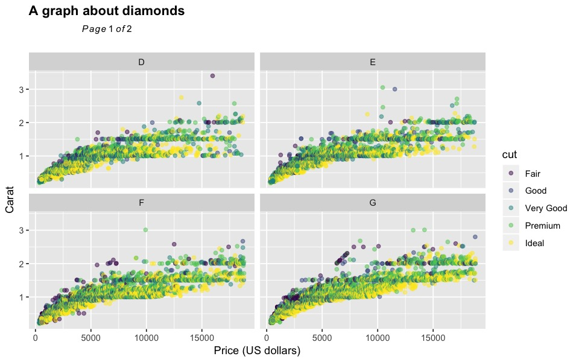
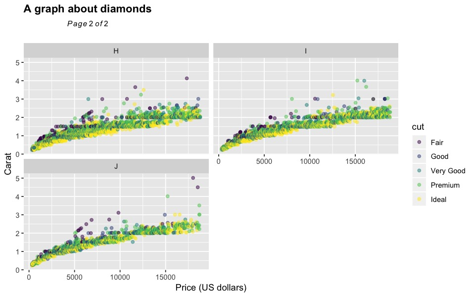
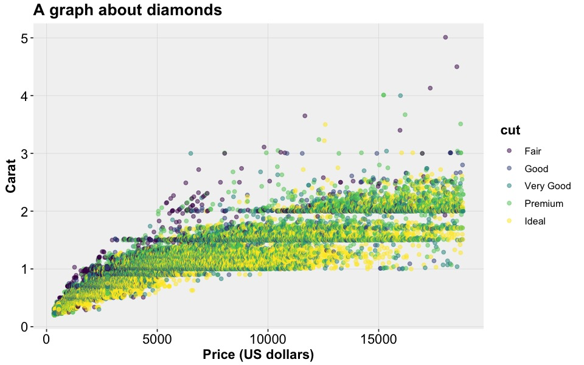

```{r setup, include=FALSE}
knitr::opts_chunk$set(echo = TRUE,
                      fig.path = 'inst/img/', 
                      dev = 'jpeg', 
                      fig.ext = 'jpg', 
                      fig.show = 'hide',
                      fig.width = 8, 
                      fig.height = 5, 
                      dpi = 120)
```

[](https://www.repostatus.org/#abandoned)

# ggplus
## __Warning__
The development of `ggplus` is no longer supported, and the current package version is not compatible with ggplot (>=2.2.0). As an alternative I suggest that you use the very good [`facet_wrap_paginate()`](https://ggforce.data-imaginist.com/reference/facet_wrap_paginate.html) or [`facet_grid_paginate()`](https://ggforce.data-imaginist.com/reference/facet_grid_paginate.html) from the [`ggforce`](https://ggforce.data-imaginist.com/) package. 

## Rationale

To facilitate data exploration and model diagnostics by providing additional functions for `ggplot2`.


## Installation

### Install the `ggplus` package 

```{r, eval = FALSE}
devtools::install_github("guiastrennec/ggplus")
```

*Note:* Trying to install the package the `install.packages('ggplus')` (reserved for packages available on CRAN-like repositories) would result in the following error:
```
Warning in install.packages :
  package ‘ggplus’ is not available (for R version 3.3.1)
```

### Load `ggplus` package

```{r, message=FALSE}
library(ggplus)
```


## Package content

### `facet_multiple()`

`facet_multiple()` is an extension of `facet_wrap()` in `ggplot2` that allows to split panels over multiple pages.

#### Example
```{r facet_multiple}
# Generate ggplot object
p <- ggplot(diamonds, aes(x = price, y = carat, color = cut)) +
geom_point(alpha = 0.5) +
labs(x     = 'Price (US dollars)',
     y     = 'Carat',
     title = 'A graph about diamonds')

# Plot on multiple pages (output plot to R/Rstudio)
facet_multiple(plot = p, 
               facets = 'color', 
               ncol = 2, 
               nrow = 2)
```

#### Result
##### First page




##### Last page




#### Save plots

To save the plots into files (pdf, png, etc.), `facet_multiple` should be called after a file connection has been oppened.

```{r, eval = FALSE}
pdf('multiple_page_plot.pdf')
facet_multiple(plot = p, 
               facets = 'color', 
               ncol = 2, 
               nrow = 2)
dev.off()
```


### `facet_layout()`

Is an extension of `facet_wrap()` in `ggplot2` that prevent the layout from automatically filling in the entire page. This function can be used on its own but was designed to be used by `facet_multiple()`.


### `theme_readable()`

Theme intended to make `ggplot2` more readable when used in presentation or papers by using black and bold font. In addition the contrast on the background and grid lines was reduced to focus the attention on the data itself.


#### Usage

```{r theme_readable}
p + theme_readable(base_size       = 12,
                   legend_position = "right")
```

```{r theme_classic, include=FALSE}
print(p)
```


#### Result
##### Classic `ggplot2` theme   


##### `theme_readable()`   



