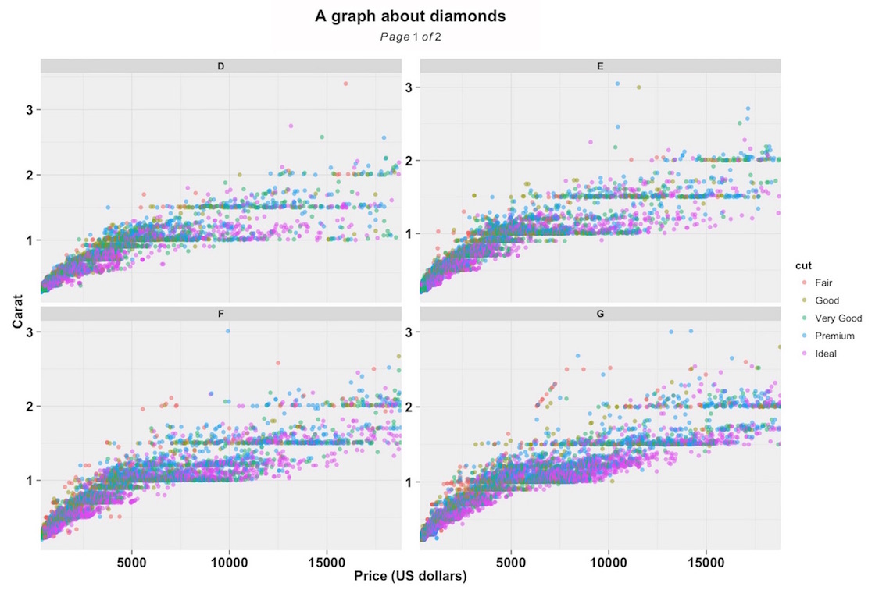
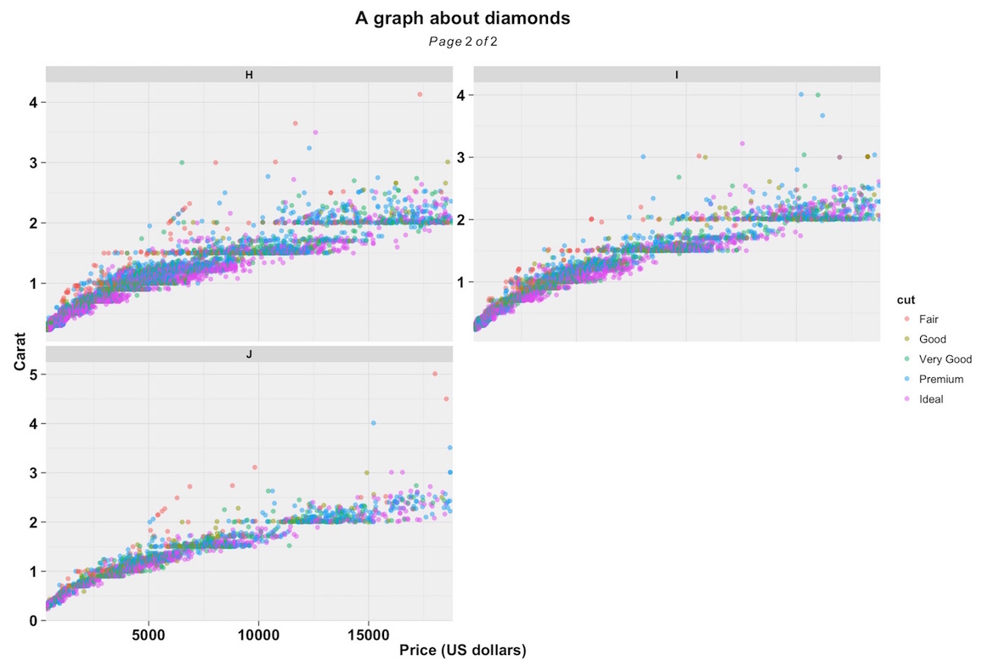
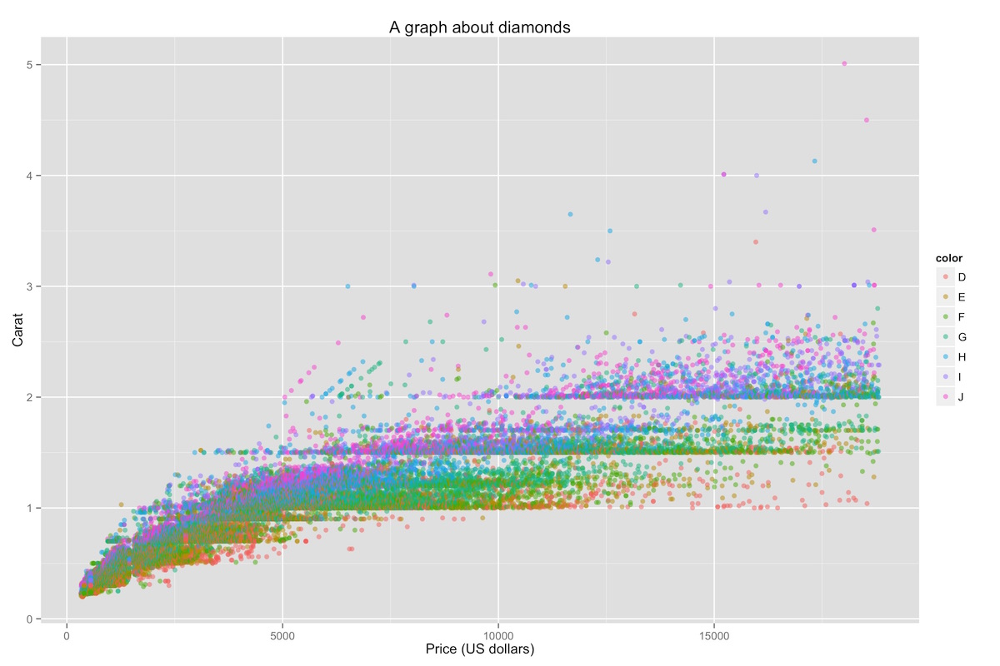
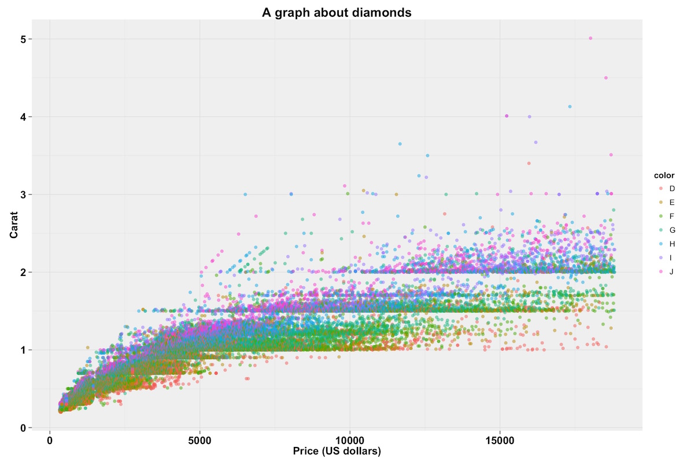
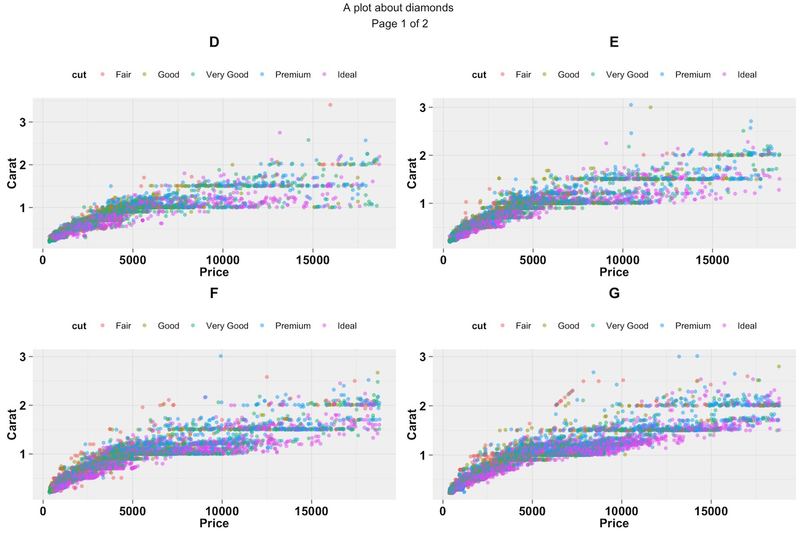
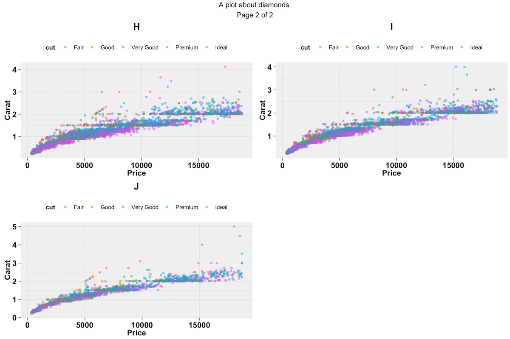

[](https://travis-ci.org/guiastrennec/ggplus)

# `ggplus`
Set of additional functions for `ggplot2`

## Rationale
To facilitate data exploration and model diagnostics by providing additional functions for `ggplot2`.

## Installation
```r
# Install ggplus package (first time only)
devtools::install_github("guiastrennec/ggplus")

# Load ggplus package
library(ggplus)
```
## Package content
### `facet_multiple()`
`facet_multiple()` is an extension of `facet_wrap()` in `ggplot2` that allows to split panels over multiple pages.

#### Example
```r
# Generate ggplot object
p <- ggplot(diamonds, aes(x = price, y = carat, color = cut)) +
geom_point(alpha = 0.5) +
labs(x     = 'Price (US dollars)',
     y     = 'Carat',
     title = 'A graph about diamonds')

# Plot on multiple pages
facet_multiple(plot = p, facets = 'color', ncol = 2, nrow = 2)
```

#### Result
##### First page   


##### Last page   



### `facet_layout()`
Is an extension of `facet_wrap()` in `ggplot2` that prevent the layout from automatically filling in the entire page. This function can be used on its own but was designed to be used by `facet_multiple()`.


### `theme_readable()`
Theme intended to make `ggplot2` more readable when used in presentation or papers by using black and bold font. In addition the contrast on the background and grid lines was reduced to focus the attention on the data itself.

#### Example
```r
# Generate ggplot object
p <- ggplot(diamonds, aes(x = price, y = carat, color = cut)) +
geom_point(alpha = 0.5) +
labs(x     = 'Price (US dollars)',
     y     = 'Carat',
     title = 'A graph about diamonds')

# Add theme_readable()
p <- p + theme_readable(base_size       = 12,
                        legend.position = "right")
```

#### Result
##### Classic `ggplot2` theme   


##### `theme_readable()`   



## Plot on multiple pages using `marrangeGrob`
The library `gridExtra` features the function `marrangeGrob` an equivalent to `arrangeGrob` that allows to split the grobs over multiple pages.

The example below shows how to reproduce the plot described under `facet_multiple()`.
```r
library(ggplus)
library(gridExtra)

# Using the same example as in facet_multiple()
p <- ggplot(diamonds, aes(x = price, y = carat, color = cut)) +
  labs(x = 'Price', y = 'Carat', title = 'A plot about diamonds') +
  geom_point(alpha = 0.5) + theme_readable(legend.position = 'top')

# Generate ggplot2 plot for each level
plot.list <- by(data     = diamonds,
                INDICES  = diamonds$color,
                simplify = TRUE,
                FUN      = function(x) {
                  p %+% x + ggtitle(unique(x$color))
                })

# Build the pages
multi.plot <- marrangeGrob(grobs = plot.list,
                           nrow = 2, ncol = 2,
                           top = quote(paste(p$labels$title,'\nPage', g, 'of', pages)))

# Save pages
pdf('Example_marrangeGrob.pdf', w = 12, h = 8)
 print(multi.plot)
dev.off()
```

##### First page   


##### Last page   



[](https://bitdeli.com/free "Bitdeli Badge")

